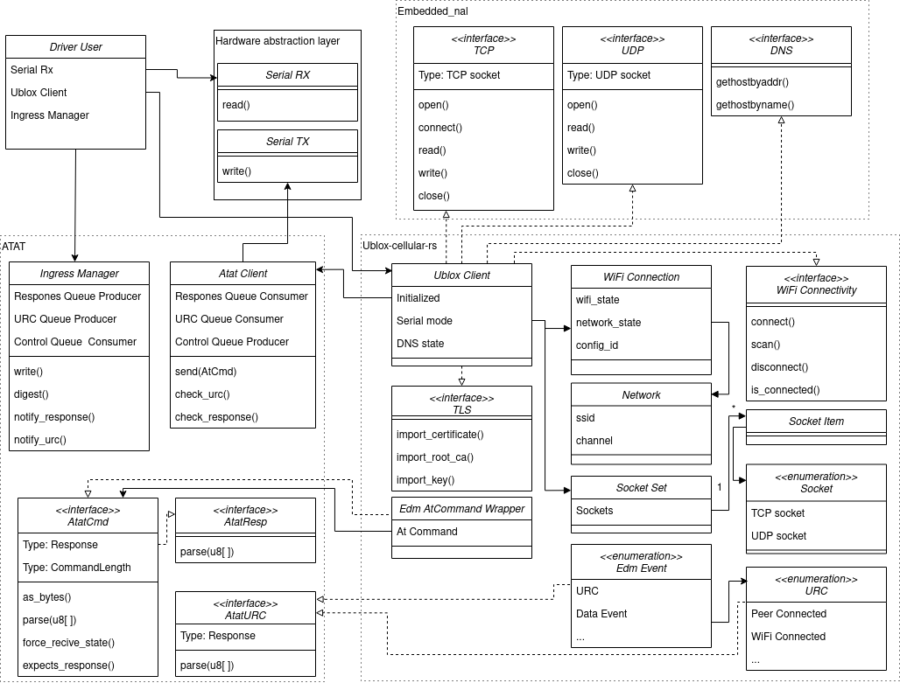

# ublox-short-range

> no_std driver crate for interfacing with the ublox short range family over serial

![No Std][no-std-badge]
![Test][test]
[![Code coverage][codecov-badge]][codecov]
<!--
[![Crates.io Version][crates-io-badge]][crates-io]
[![Crates.io Downloads][crates-io-download-badge]][crates-io-download]
-->

---

A driver crate for AT-command based serial ublox short range modules, built on top of [atat].
The driver aims to be compatible with the ublox short range modules:
- odin_w2xx
- nina_w1xx
- nina_b1xx
- anna_b1xx
- nina_b2xx
- nina_b3xx

[atat]: https://crates.io/crates/atat

## Documentation
Design diagram:  

Relevant docs:
- https://www.u-blox.com/en/docs/UBX-14044127
- https://www.u-blox.com/en/docs/UBX-14044126
- https://www.u-blox.com/en/docs/UBX-16024251

Relevant repos:
- https://github.com/u-blox/u-connectXpress-host-library
- https://github.com/particle-iot/device-os
- https://github.com/u-blox/ubxlib

## Tests

> The crate is covered by tests. These tests can be run by `cargo test --tests --all-features`, and are run by the CI on every push.

<!--
## Examples
The crate has examples for running it on a linux platform.

The samples can be built using `cargo build -p linux_example --target x86_64-unknown-linux-gnu`, and similarly run using `cargo run`
-->

## Features

- device selection (must select one, and only one!):
    - `odin_w2xx`
    - `nina_w1xx`
    - `nina_b1xx`
    - `anna_b1xx`
    - `nina_b2xx`
    - `nina_b3xx`
- `socket-tcp`: Enabled by default. Adds TCP socket capabilities, and implements [`TcpStack`] trait.
- `socket-udp`: Enabled by default. Adds UDP socket capabilities, and implements [`UdpStack`] trait.
- `defmt-default`: Disabled by default. Add log statements on trace (dev) or info (release) log levels to aid debugging.
- `defmt-trace`: Disabled by default. Add log statements on trace log levels to aid debugging.
- `defmt-debug`: Disabled by default. Add log statements on debug log levels to aid debugging.
- `defmt-info`: Disabled by default. Add log statements on info log levels to aid debugging.
- `defmt-warn`: Disabled by default. Add log statements on warn log levels to aid debugging.
- `defmt-error`: Disabled by default. Add log statements on error log levels to aid debugging.

## License

Licensed under either of

- Apache License, Version 2.0 ([LICENSE-APACHE](LICENSE-APACHE) or
 http://www.apache.org/licenses/LICENSE-2.0)
- MIT license ([LICENSE-MIT](LICENSE-MIT) or http://opensource.org/licenses/MIT)

at your option.

### Contribution

Unless you explicitly state otherwise, any contribution intentionally submitted
for inclusion in the work by you, as defined in the Apache-2.0 license, shall be
dual licensed as above, without any additional terms or conditions.

<!-- Badges -->
[no-std-badge]: https://img.shields.io/badge/no__std-yes-blue
[test]: https://github.com/BlackbirdHQ/ublox-short-range-rs/workflows/Test/badge.svg
[codecov-badge]: https://codecov.io/gh/BlackbirdHQ/ublox-short-range-rs/branch/master/graph/badge.svg
[codecov]: https://codecov.io/gh/BlackbirdHQ/ublox-short-range-rs
<!--
[crates-io]: https://crates.io/crates/ublox-short-range-rs
[crates-io-badge]: https://img.shields.io/crates/v/ublox-short-range-rs.svg?maxAge=3600
[crates-io-download]: https://crates.io/crates/ublox-short-range-rs
[crates-io-download-badge]: https://img.shields.io/crates/d/ublox-short-range-rs.svg?maxAge=3600
-->
